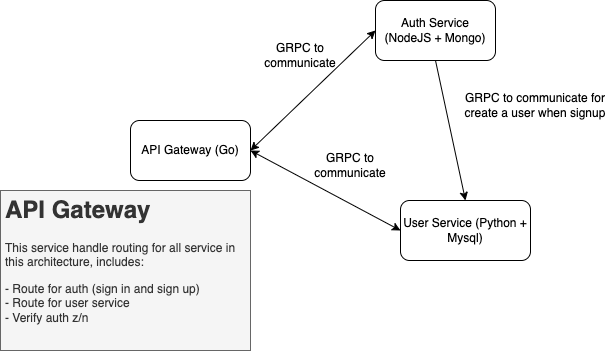

# Study Microservices Architecture
A microservice architecture – a variant of the service-oriented architecture
structural style – is an architectural pattern that arranges an application as a collection
of loosely-coupled, fine-grained services, communicating through lightweight protocols

## Architecture Diagram

## Prequisite
  ### Auth Service
  - NodeJs v18.13
  - Yarn
  - Mongodb

  ### Users Service
  ### Gateway

## How to install
  ### Auth Service
  - Install all dependencies `Yarn install`
  - Run auth service `yarn start`
  - try to test grpc with postman grpc with url `localhost:50051`

  ### Users Service
  ### Gateway
